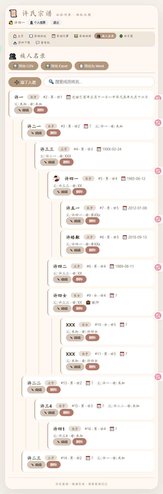
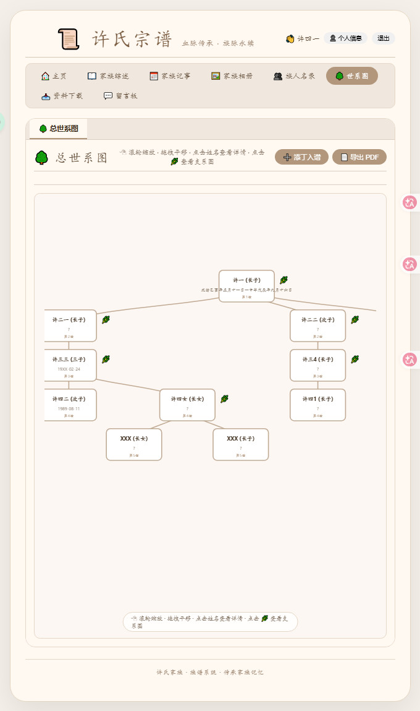

# 📜 许氏宗谱 · 族谱管理系统

> 一个功能完整的家族族谱管理 Web 系统，支持成员管理、世系图展示、家族记事、相册、留言板等功能。

---

## 📖 项目简介

本系统是一个基于 PHP + SQLite 开发的家族族谱管理系统，旨在帮助家族成员记录、管理和传承家族历史。系统界面简洁优雅，功能完整，适合各姓氏家族使用。

### 主要特点

- 🏠 **首页概览** - 家族综述、最新成员、最新照片、统计卡片
- 👥 **族人名录** - 完整的成员列表，支持搜索、分页、导出
- 🌳 **世系图** - 交互式树形结构，直观展示家族血脉传承
- 📅 **家族记事** - 记录家族大事记，支持图片上传
- 🖼️ **家族相册** - 分类管理家族照片，支持全屏查看
- 💬 **留言板** - 家族成员互动交流
- 📥 **资料下载** - 共享家族资料文件
- 🔐 **用户系统** - 登录/注册，权限管理
### 截图：






---

## 🛠️ 技术栈

| 技术 | 说明 |
|------|------|
| **后端** | PHP 7.4+ |
| **数据库** | SQLite 3 |
| **前端** | HTML5 + CSS3 + JavaScript |
| **可视化** | D3.js (世系图渲染) |
| **图表库** | D3.js v7 |
| **部署** | 支持 Apache / Nginx |

---

## 📁 目录结构

```
族谱系统/
├── index.php              # 主入口文件
├── config.php             # 数据库配置与初始化
├── auth.php               # 用户认证（登录/注册/个人信息）
├── member_actions.php     # 成员CRUD操作API
├── tree.php               # 世系图数据构建
├── script.js              # 前端核心JavaScript
├── style.css              # 全局样式
│
├── pages/                 # 页面模板
│   ├── home.php           # 首页
│   ├── summary.php        # 家族综述
│   ├── members.php        # 族人名录
│   ├── pedigree.php       # 世系图
│   ├── events.php         # 家族记事
│   ├── photos.php         # 家族相册
│   ├── guestbook.php      # 留言板
│   └── downloads.php      # 资料下载
│
├── uploads/               # 上传文件目录
│   ├── avatars/           # 成员头像
│   ├── photos/            # 相册照片
│   └── events/            # 记事图片
│
├── js/                    # 第三方库
│   └── d3.v7.min.js       # D3.js 可视化库
│
└── data/
    └── family_tree.db         # SQLite数据库文件（自动生成）
```

---

## 🚀 快速开始

### 环境要求

- PHP 7.4 或更高版本
- SQLite3 扩展
- Web 服务器（Apache / Nginx）

### 安装步骤

1. **下载源码** 到 Web 目录

2. **设置目录权限**
```bash
chmod 777 uploads/
chmod 777 uploads/avatars/
chmod 777 uploads/photos/
chmod 777 uploads/events/
chmod 777 uploads/downloads/
```

3. **访问系统**
   - 浏览器打开 `http://localhost/族谱系统/`
   - 数据库会自动初始化

4. **默认账号**
   - 用户名：`admin`
   - 密码：`123456`

---

## 📚 功能详解

### 1. 首页 (`home.php`)

| 模块 | 功能 |
|------|------|
| 家族综述 | 显示家族简介，点击跳转完整页面 |
| 最新记事 | 显示最新一条家族记事 |
| 最新留言 | 显示最新一条留言 |
| 统计卡片 | 成员数、记事数、照片数、留言状态 |
| 最新成员 | 最近添加的10位成员 |
| 最新照片 | 最近上传的10张照片 |

### 2. 族人名录 (`members.php`)

- 📋 完整成员列表，按世代排序
- 🔍 **搜索**：按姓名搜索成员
- ➕ **添丁入谱**：新增成员
- 📊 **导出**：支持 CSV、Excel、Word 格式
- 📄 **分页**：每页50条

**成员信息包括：**
- 姓名、性别、世代、排行
- 出生日期、逝世日期
- 父亲、母亲
- 职业、居住地址
- 生平履历
- 配偶信息（姓名、出生、逝世、娘家、履历）
- 头像

### 3. 世系图 (`pedigree.php`)

- 🌳 **总世系图**：D3.js 渲染的树形结构
- 🔄 **缩放**：滚轮缩放，拖拽平移
- 🌿 **支系图**：点击节点的 🌿 图标查看以该成员为始祖的支系
- 👆 **点击姓名**：弹出成员详情
- 📄 **导出PDF**：将世系图导出为 PDF

### 4. 家族记事 (`events.php`)

- 📝 添加/编辑/删除家族记事
- 🖼️ 支持上传图片（显示在内容末尾）
- 📅 按日期排序
- 🔒 仅登录用户可操作

### 5. 家族相册 (`photos.php`)

- 📁 **相册分类**：创建多个相册
- 📷 **上传照片**：支持图片上传
- 🖼️ **全屏查看**：点击照片全屏放大、缩放、旋转、拖拽
- ✏️ **编辑**：修改照片标题、描述、移动相册
- 🔒 仅登录用户可操作

### 6. 留言板 (`guestbook.php`)

- 💬 访客留言
- 🔒 登录用户可回复
- 📋 显示留言时间、IP

### 7. 资料下载 (`downloads.php`)

- 📤 上传资料（登录用户）
- 📥 下载资料（自动统计下载次数）
- ✏️ 编辑/删除（上传者或管理员）
- 🏷️ 自动识别文件格式图标

### 8. 用户系统

| 功能 | 说明 |
|------|------|
| 注册 | 新用户注册，可关联族谱成员 |
| 登录 | 用户名 + 密码 |
| 个人信息 | 修改真实姓名、关联成员、密码 |
| 权限 | 登录用户可编辑/删除/上传 |

---

## 🔧 配置说明

### 修改家族名称

在 `config.php` 中找到并修改：

```php
function getClanName() {
    return '许氏';  // 改成你的姓氏
}
```

### 数据库配置

数据库文件 `family_tree.db` 会自动创建，无需手动配置。

### 上传文件大小限制

如需调整，修改 `php.ini`：
```ini
upload_max_filesize = 20M
post_max_size = 20M
```

---

## 📊 数据库结构

### members（成员表）
| 字段 | 类型 | 说明 |
|------|------|------|
| id | INTEGER | 主键 |
| name | TEXT | 姓名 |
| gender | TEXT | 性别 |
| birth_date | TEXT | 出生日期 |
| death_date | TEXT | 逝世日期 |
| father_id | INTEGER | 父亲ID |
| mother_id | INTEGER | 母亲ID |
| generation | INTEGER | 世代 |
| rank | TEXT | 排行 |
| profession | TEXT | 职业 |
| address | TEXT | 地址 |
| biography | TEXT | 生平 |
| spouse_name | TEXT | 配偶姓名 |
| avatar | TEXT | 头像路径 |

### users（用户表）
| 字段 | 类型 | 说明 |
|------|------|------|
| id | INTEGER | 主键 |
| username | TEXT | 用户名（唯一） |
| password | TEXT | 密码（哈希） |
| real_name | TEXT | 真实姓名 |
| member_id | INTEGER | 关联成员ID |

### 其他表
- `relationships` - 成员关系
- `clan_events` - 家族记事
- `photo_albums` - 相册分类
- `clan_photos` - 照片
- `guestbook` - 留言板
- `downloads` - 资料下载
- `clan_summary` - 家族综述

---

## 🖥️ 浏览器兼容性

| 浏览器 | 支持版本 |
|--------|----------|
| Chrome | 60+ |
| Firefox | 55+ |
| Edge | 79+ |
| Safari | 12+ |
| 移动端 | 响应式设计，支持手机/平板 |

---

## 📝 开发建议

### 二次开发指南

1. **添加新页面**：在 `pages/` 目录创建 `xxx.php`，在 `index.php` 导航中添加链接
2. **修改样式**：编辑 `style.css`
3. **修改功能**：编辑 `script.js`
4. **添加API**：在 `member_actions.php` 中添加新的 action

### 安全建议

- 建议修改默认管理员密码
- 生产环境建议使用 HTTPS
- 定期备份数据库 `family_tree.db`

---

## 📄 开源协议

本项目仅供学习和个人使用。

---

## 📞 联系方式

如有问题或建议，请通过留言板反馈。

---


**📜 完善 宗谱 · 血脉传承 · 族脉永续**